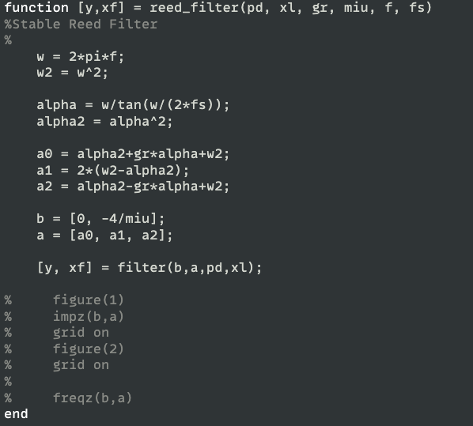
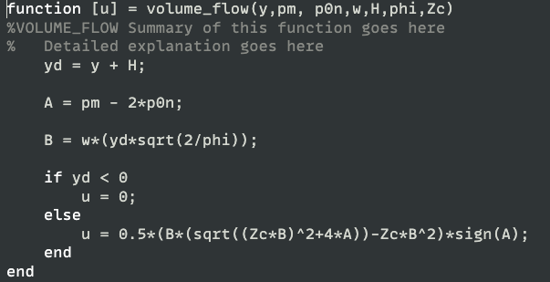

# Introduction

The purpose of this project was to learn how to implement a waveguide
based clarinet model using methods seen in class. I accomplished my task
by implementing the stable reed filter model from week nine coupled with
the cylindrical model of week 8. The physical values found in this
report were obtained from Guillemain's paper \[\] and Gary Scavone's
paper \[\].

As my main instrument is the clarinet, I wished to learn about the
physics involved in its sound generation. Thank to this class and my
final project, I was able achieve just that.

Now let's start by going through a quick review of the clarinet modules.

## Cylindrical Air Column

Figure 1: A cylindrical pipe in cylindrical polar coordinates.

The cylindrical air column is a type of resonator that utilizes its
shape as a feedback system to sustain specific frequencies within a
sound oscillating through it. By varying its tube length the air column
can play different frequencies. The length must not vary the timbre of
the sound, in other words the ratio between the 1^st^ and consequent
harmonics of the sound. The wave propagation within the column is
planar, and so can simply be represented by a one dimensional wave
equation.

The transverse modes do exist within the waves motion, however the
cylindrical bore only weakly excites them. More can be learned about
this effect in Gary's thesis paper. \[\]

Hence if we are to represent the cylindrical bore as a waveguide model
it would look like this:

Figure 2 Digital waveguide model of a closed-open cylindrical bore.

The two delay lines would represent the wave's motion propagating down
the air column and back.

The shorter the length, the shorter the delay line. Once the pressure
wave reaches the end of the pipe at $x = L$ , and so we must calculate
the reflection coefficient of the sound $R_{L}$ with first or second
order filter. Generally, the reflection function is:

Where $Z_{L}$ is the load impedance at the end of the tube and $Z_{c}$
is the characteristic impedance of the cylindrical bore.

The characteristic impedance can be determined by:

Where $P(x,t)\ $is the equation of motion of the pressure wave and
$U(x,t)$ it's volume flow equivalent. So, we notice that $Z_{c}$ is
dependent on the mass density of air $\rho$ speed of sound c and the
cross-sectional area of the cylinder.

The Load impedance is determined numerically, however we have some edge
cases we can discuss, when the cylinder is an open end, $Z_{L} = 0$ and
$R_{L} = \  - 1$ which means complete reflectance with inversion. When
$Z_{L} = \infty$ then $R_{L} = \ 1$, complete reflection of the wave
without inversion.

Once we have determined these values, we can compute the pressure
directly at any point in the model. However, to save on computation
power we only need to compute the pressure response at the entrance of
the air column at $x\  = \ 0\ $by the introduction of either a unitary
pressure impulse at the entrance to the model
$\left( Z_{c}\delta\lbrack n\rbrack \right)$ which returns the impulse
response $h(t)$ or a continual pressure input from an excitation source
like a reed model.

## Reed model.

The reed can be considered as a pressure-controlled excitor that inputs
an amount of relatively static pressure into the instrument that get
converted into acoustic energy within the bore and outputs a sound who's
note and timbre is dependent on the dimensions of the pipe.

The flow and reed movement are controlled by the difference in pressures
in the mouthpiece and the resulting air columns pressure,
$p\Delta = p_{m} - p(0,t)$,

The volume flow $u\ $through the reed is derived from the Bernoulli
equation,

I we were to assume that there is no change in height within each
cavity, $y_{1} = y_{2} = 0$ then,

Then if in the big cavity $u_{u} = 0$ then we can say that it's velocity
$v_{1} = 0$ and thus,

And assuming that y is balanced along a point of equilibrium $H$

The reed's motion, represented in the volume flow as $y$, is composed by
its interaction with the rest of the instrument by the difference in
pressure $p\Delta$ which forces the reed opening either shut or open
causing it to oscillate. As such we can view it as a mass spring damper
system.

Its system of equation is:

To solve the approximate interaction at the junction between the reed
and the instruments air column $p(0,t)$, we must start by solving the
mass spring dampers system of equation.

First by first deriving its Laplace transform and then directly applying
the bilinear transform, we get

Where $\alpha$ is the bilinear transform's constant.

Now in implementation of the filter model, there is the use of a feed
forward coefficient which when fed into the volume flow model would make
the reed model non explicit. As a solution we do not need to consider
the feedforward values, leaving us with:

Since the zeros are at $z = \  \pm 1$ as we can see here,

The numerator values only affect the phase offset and the decaying
oscillation term and thus we can modify them without affecting the
desirable qualities of the filter like its stability or behavior.

Now given that the volume flow solved above does not immediately depend
on $p\Delta$, we can create an explicit solution:

If $y + H < \ 0$ then $u_{0} = 0$.

This has been a summary of the section that compose the clarinet model
seen in this paper.

# Method

As the cylindrical model has already been implement in one of the
classes assignments, I will first focus on implementing the reed model.

## Reed Model

It is mainly comprised of two parts, the stable reed filter, and the
volume flow equation both discussed in the intro.

\[Bloc Diagram Here\]

Within the main loop

The reed filter will take the pressure difference (pd) that was has
calculated one sample before. Since the filter will only receive one
sample at a time I employ zf and zl to save the filters values (more
specifically the position of the reed). These are concidered the filters
initial and final conditions. Let's say we have a filter:

We are not saving the values of $y\lbrack n - 1\rbrack$ and
$y\lbrack n - 2\rbrack$ at the output. Z_l and Z_f will instead do that
for you, where z_l is used as the input and z_f is it resulting output.

To find out that the constantes of the filter were correct, I ploted
their graph out anc compared to values found in Gary's paper \[\]

As we can see the values do coincide which yield to believe the reed
filter is properly modeled.

Once we have determiend y, we can pass it into the volume flow function.
This will also take the mouth pressure that we had determined in the
intro and the incoming pressure value from down the cylindrical tube p-.
If y + H \< 0 then the reed opening is set to be closed and the volume
flow is set to 0. Otherwise we compute the explicit solution mentioned
in the intro.

Now that we have computed the volume flow we can scale it by Zc and pass
it into the cylindrical model.

## Cylindrical Model

To implement the cylindrical Model, I simply used two delay lines that
are looped through whose length is determined by the invers ratio
between the frequency being played and the sampling frequency. There is
only one pointer that keeps track of the position through the bore but
that also wraps around when reaching the end of the delay lines. The
length of the bore is represented with the note that is to be played and
the area is set to 0.008 meters as that is the value used to determine
numerically the reflection function values that are used here from
another assignment. The characteristic impedance is determined with
$Z_{c} = \frac{\rho c}{\pi r^{2}}$.

## Basic Clarinet model

Putting both sections together the basic model is as such:

The resulting pressure is determined by the incoming and outgoing
pressure at the input:

It is important to be aware of the order in which values are saved and
written to in delay lines. Here is the basic algorithm of the model:

1.  Save the incoming pressure value $p^{-}$,

2.  Compute the reed's position using $p\Delta$ that was computed one
    cycle before

3.  Compute the resulting volume flow from the reed using the mouth
    pressure $p_{m}$, the incoming pressure $p^{-}$ and the previously
    computed position $y$,

4.  Compute the input into the incoming delay line using the output of
    the outgoing delay line

5.  Compute and insert the value into the outgoing delay line

6.  Compute the resulting pressure $p_{0}$

7.  Compute the new $p\Delta$

Procedures \[2,3\] and 4 can be inversed with no consequences as they
are not dependent on each other.

As we see here, we must extract the outgoing values of each delay line
first before inserting the new values into them as they occupy the same
position respectively. As such, order is important. There are also
creative ways to avoid using temporary variables. In this case, when
saving $p^{-}$ I store it in $p_{0}$ as it's value will not be updated
until step 6. And to avoid having to compute step 5 twice as that same
value is used in step 6 in $p_{0},$ we can simply reuse the value from
step 5.

## Results

Figure 3 :The top figure is the implemented clarinet model in MATLAB;
the middle figure is the model implemented in the stk toolkit; the
bottom figure is a frequency response comparison between the two
implementations

To obtain the resulting clarinet model, the parameter values used are:

Figure 4

With these results the generated sound approaches that of an actual
clarinet.

To obtain a more natural sound, an envelope is applied to the mouth
pressure values ramping it from 0 to
$\mu H\left( 2\pi f_{r} \right)^{2}$ in approximately 100 milliseconds.
Noise and vibrato are also added for similar reasons.

By changing the variables $H,\ \mu$ it affects the rate at which the
resulting pressure will ramp but beware that it will also affect the
upper harmonics of the sound. Reducing $H$ will reduce $u_{0}$ which
leads to a reduction of $p_{\Delta}$ which results in a removal of
energy in the higher harmonics due too the reed filter. Inversely,
increasing the reed's dynamic mass per area will have the same effect as
$H$ as it affects the numerator of the filter,
$\frac{4z^{- 1}}{\mu_{r}}$.

To have the clarinet model play non-integer-based frequencies and
compare it properly with the stk toolkit version, I implemented an
interpolated delay line.

With some tunning of the note's frequency, I was able to line up the
sounds rather well resulting in:

Figure 5

## Discussion

The results of the presented clarinet model have been shown. When
compared to the stk model, the frequency response de resemble, however
the resulting sounds differ in their amplitude envelope. The amplitude
variation in the stk model is most likely due to the applied reverb, a
ramped down envelope, and the difference in reed models. When attempting
to apply a downwards ramping envelope on the mouth pressure in my model,
it created issues with the filters returning imaginary numbers. Hence
why there is only an envelope on the upwards motion.

The stk version also utilises a reedtable \[\] as the reed's
implementation. In turn, it is coupled to a cylindrical tube model whose
delay lines are combined and the one zero reflection filter is commuted
to the end of the delay line. This in turn makes the model more
computationally efficient by taking advantage of approximations being
made to the model.

## Conclusion

...

Both models yield similar sound

The matlab version does however yield a solid clarinet model whose
sounds are similar. To iterate over it, one can add a bell transmission
coefficient and model tone holes.
